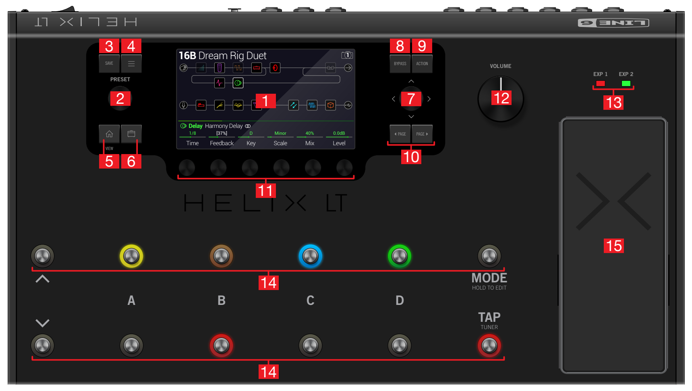

# UI Overview

<figure><figcaption>
Top Panel
</figcaption></figure>

1. Main Display (see [views.md](views.md "mention"))
2. PRESET Knob/Button (see [selecting-a-preset.md](../working-with-presets/selecting-a-preset.md "mention"))
3. SAVE Button (see [saving-a-preset.md](../working-with-presets/saving-a-preset.md "mention"))
4. MENU Button
5. HOME Button - Press this if lost
6. TONE Button - Press to quickly jump to the tone (Gain, Bass, Mid, Treble) of any Amp+Cab, Amp, and Preamp models in the current Preset
7. Joystick - Used in a variety of situations for a variety of purposes
8. BYPASS Button - Turns the selected Block on and off
9. ACTION Button - Similar to the Joystick, has a variety of purposes based on context
10. :arrow\_backward: PAGE and PAGE :arrow\_forward: - Scrolls through pages of Block parameters (see [changing-block-parameters.md](../working-with-presets/editing-a-preset/changing-block-parameters.md "mention"))
11. Knobs 1-6 - If a Parameter appears directly above the knob in the Main Display, turning the knob adjusts the value of the parameter, clicking the knob resets the value. If a button appears instead, clicking the knob 'clicks' the button
12. VOLUME Knob
13. EXP 1&2 LEDs - Tells you whether the expression pedal is controlling parameters set to EXP 1 or EXP 2
14. Footswitches - Your primary UI while playing to turn on/off Blocks, select Presets, change Modes, access the Tuner, etc. Footswitches are also touch sensitive, some functionality is accessed by touching (not pressing) the top of a footswitch
15. Expression Pedal - Primarliy used to control Volume but most parameters can be linked to the pedal for live control of things like Wah, Tremelo, Overdrive, etc. There is a switch hidden under the toe end of the pedal (some extra force is required to activate it) which toggles the pedal between controlling parameters bound to EXP 1 and EXP 2
